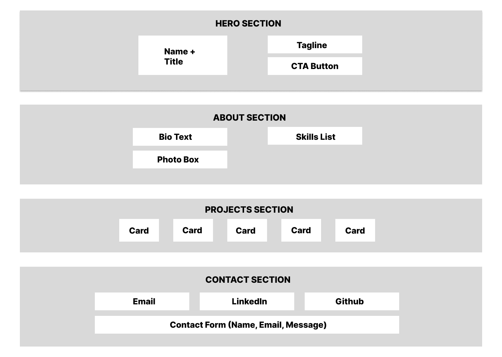

# 🧠 Portfolio Planning Notes — Day 19

## 🎯 Goals
- Showcase my skills, personality, and projects
- Create a clean, responsive, accessible layout
- Reflect my interest in Web development, accessibility, and thoughtful design

## 🧱 Layout Structure (Wireframe)

Frame: 1440×1024

### 🏠 Hero Section
- Name + Tagline
- CTA Button (“View Projects”)

### 👤 About Section
- Bio text
- Skills list
- Optional photo

### 🧰 Projects Section
- 3–5 cards with title, tech stack, link

### 📬 Contact Section
- Email, LinkedIn, GitHub
- Optional contact form

## 🎨 Visual Theme
- **Color palette**: Clean light mode with subtle accents
  - Background: `#F9FAFB` (soft off-white)
  - Primary accent: `#0055A5` (trustworthy blue)
  - CTA button: `#00A99D` (fresh teal)
  - Text: `#1F2937` (deep gray), `#6B7280` (muted gray)
- **Fonts**: Modern sans-serif for clarity, optional monospace for code
  - Headings: `'Poppins'` or `'Montserrat'`
  - Body: `'Inter'`
  - Code snippets: `'Fira Code'`
- **Vibe**: Professional, clean, and confidently modern — with subtle creative flair

## 🧭 Navigation Plan
- Sticky header with smooth scroll
- Mobile hamburger menu
- Skip link for accessibility

## 📱 Accessibility & Responsiveness
- ARIA roles and labels
- Keyboard navigation
- Responsive layout with media queries
- Lighthouse audit target: 90+

## 📁 Folder Structure